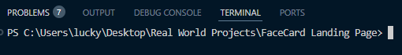

# Guide

***Make sure na nakainstall ang nodejs sa device before proceding sa project***
[text](https://nodejs.org/en)

after magclone ng repository

run "npm i" sa terminal ng vscode. make sure na nasa directory ka ng mismong project folder

used tailwindcss for styling but pwedeng customized styles.
ilalagay yung custom styles sa output.css
yung input.css is no need galawin

## documentation for tailwindcss
[text](https://tailwindcss.com/docs/font-family)

used daisyui rin for component libraries. mga prebuilt components na pwedeng gamitin

## docu
[text](https://daisyui.com/components/button/)